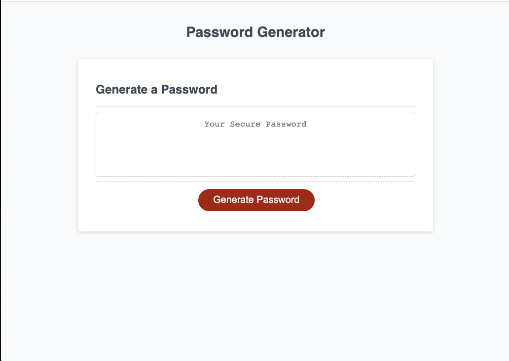

# Strong Password Generator

## Description
This web application is designed to create a strong password to reduce a user's risk of being hacked or having sensitive information stolen. Since every online account requires different strong password parameters, this applicaiton will ask the user which types of characters should be included. 

## Installation 
You can view this code by exploring the files on GitHub or pulling them into VS Code via Git in the CLI.

## Usage 
You can use this webpage to generate a random strong password by clicking the red 'Generate Password' button. The box will then populate with a strong password. Then simply copy and paste your password to use it! 

Deployed Application here: 

## Credits 
I used the following resoucres to complete this project: 
W3 Schools: https://www.w3schools.com/js/js_random.asp
Sabe: https://sabe.io/blog/javascript-yes-no-confirmation-box
Mozilla: https://developer.mozilla.org/en-US/docs/Web/JavaScript/Reference/Global_Objects/Array/concat

## License
MIT License

Copyright (c) [2023] [TylarNicklis]

Permission is hereby granted, free of charge, to any person obtaining a copy of this software and associated documentation files (the "Software"), to deal in the Software without restriction, including without limitation the rights to use, copy, modify, merge, publish, distribute, sublicense, and/or sell copies of the Software, and to permit persons to whom the Software is furnished to do so, subject to the following conditions:

The above copyright notice and this permission notice shall be included in all copies or substantial portions of the Software.

THE SOFTWARE IS PROVIDED "AS IS", WITHOUT WARRANTY OF ANY KIND, EXPRESS OR IMPLIED, INCLUDING BUT NOT LIMITED TO THE WARRANTIES OF MERCHANTABILITY, FITNESS FOR A PARTICULAR PURPOSE AND NONINFRINGEMENT. IN NO EVENT SHALL THE AUTHORS OR COPYRIGHT HOLDERS BE LIABLE FOR ANY CLAIM, DAMAGES OR OTHER LIABILITY, WHETHER IN AN ACTION OF CONTRACT, TORT OR OTHERWISE, ARISING FROM, OUT OF OR IN CONNECTION WITH THE SOFTWARE OR THE USE OR OTHER DEALINGS IN THE SOFTWARE.
